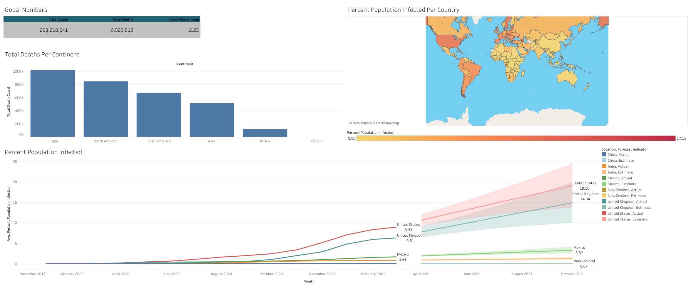

# MySQL-Portfolio-Project

### Edward Chan

## Structure
The repository has the following structure
- [Data-Exploration](Data-Exploration): Contains an SQL for uploading and gathering information about the CovidDeaths and CovidVaccinations. [Data Exploration Tutorial](https://www.youtube.com/watch?v=qfyynHBFOsM&list=PLUaB-1hjhk8H48Pj32z4GZgGWyylqv85f&ab_channel=AlexTheAnalyst)
- [Tableau](Tableau): Creates a visual Tableau to be display SQL queries [Tableau Tutorial](https://www.youtube.com/watch?v=QILNlRvJlfQ&list=PLUaB-1hjhk8H48Pj32z4GZgGWyylqv85f&index=2&ab_channel=AlexTheAnalyst)
- [Data-Cleaning](Data-Cleaning): Cleaning Information about housing in Nashville [Data Cleaning Tutorial](https://www.youtube.com/watch?v=8rO7ztF4NtU&list=PLUaB-1hjhk8H48Pj32z4GZgGWyylqv85f&index=3&ab_channel=AlexTheAnalyst)
- [Correlation-In-Python](Correlation-In-Python): Using python to find correlations between movies in python [Correlation In Python Tutorial](https://www.youtube.com/watch?v=iPYVYBtUTyE&list=PLUaB-1hjhk8H48Pj32z4GZgGWyylqv85f&index=4&ab_channel=AlexTheAnalyst)

## Getting Started
1. Install Python version 3.8.0
2. Install MySQL Workbench
3. Install Tableau
3. Clone the repository
4. Run `pip install -r requirements.txt` in terminal (If using application)

## Packages
Used Python version 3.8.0 and pip version 23.2.1
The packages used:
| Package Name | Version |
| --- | --- |
| pandas | 2.0.3 |
| numpy | 1.23.4 |
| seaborn | 0.12.2 |
| matplotlib | 3.7.2 |

## Tableau Visualisation
[Tableau public link](https://public.tableau.com/shared/WW8MMSTM6?:display_count=n&:origin=viz_share_link)

## Acknowledgement
Thank you to Alex The Analyst for the tutorial, the link for the youtube channel is [here](https://www.youtube.com/@AlexTheAnalyst)